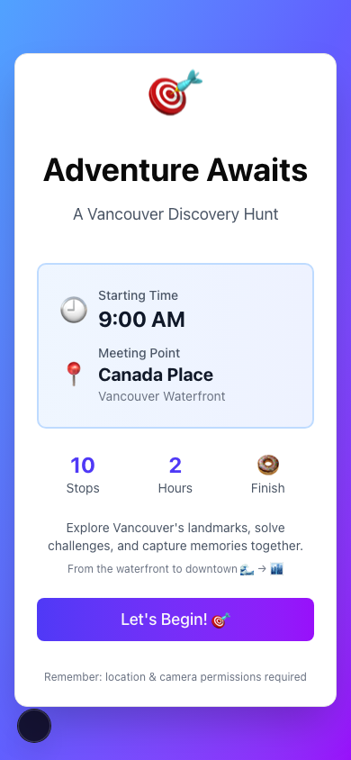
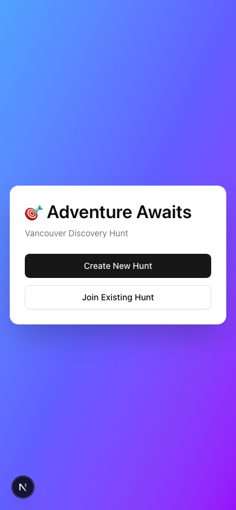

# Blind Hunt

A mobile-first scavenger hunt PWA for a Vancouver route from Canada Place to a sweet finish. It supports shared hunt sessions, GPS checks, photo capture, answer validation, hints with time penalties, and a completion gallery.

## Screenshots




## What It Does

- Creates or joins a shared hunt session with Supabase
- Guides players through 10 configured Vancouver stops
- Checks location proximity with the browser Geolocation API
- Requires a photo and validated answer at each stop
- Tracks elapsed time and hint penalties
- Works as an installable PWA on mobile browsers

## Tech Stack

- Next.js 15 with App Router
- React 19
- Tailwind CSS 4 and shadcn-style UI components
- Supabase for Postgres and realtime updates
- `next-pwa` for app manifest and service worker support

## Setup

Install dependencies:

```bash
npm install
```

Create `.env.local`:

```env
NEXT_PUBLIC_SUPABASE_URL=your-supabase-url
NEXT_PUBLIC_SUPABASE_ANON_KEY=your-supabase-anon-key
```

Create the Supabase tables by running [supabase-schema.sql](supabase-schema.sql) in the Supabase SQL editor.

Run the app locally:

```bash
npm run dev
```

Open [http://localhost:3000](http://localhost:3000).

## Deployment

Deploy on Vercel or any Next.js-compatible host. Add the same two Supabase environment variables in the host settings.

Geolocation and camera access require HTTPS in production. Vercel provides HTTPS automatically.

## Project Structure

```text
app/                 Next.js layout, page, and global styles
components/          Hunt screens, stop UI, timer, photo, and location checks
components/ui/       Reusable UI primitives
contexts/            Hunt state and Supabase realtime sync
lib/                 Hunt config, validation, geolocation, Supabase client
public/              PWA manifest and README screenshots
supabase-schema.sql  Database schema
```

## Customizing The Hunt

Edit [lib/hunt-config.ts](lib/hunt-config.ts) to change the route, stop prompts, accepted answers, GPS radius, hints, and time limits.

## Notes

Photos are currently stored as base64 strings in Supabase. That keeps the app simple, but Supabase Storage would be a better fit for a production version with larger image volume.
